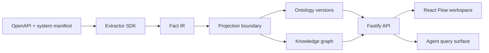

# Onto architecture

## Runtime boundaries

`packages/domain` owns runtime-validated contracts and ontology defaults. `packages/extractor-sdk` defines the plugin boundary. Extractors produce only facts. The API owns ingestion orchestration, graph projection, bounded queries, evidence lookup, and layout writes. The web app owns interaction state and never creates semantic assertions.

The local adapter is intentionally dependency-free: it seeds a deterministic fixture into an in-memory project repository so the first slice runs without Docker or credentials. The `ProjectRepository`, `GraphRepository`, `ArtifactStore`, and `JobRunner` boundaries are the seams for the planned PGlite/PostgreSQL implementation. A production worker can use the same ingestion runtime behind leased SQL jobs.

## Persistence decision

PostgreSQL remains the target baseline. Facts, evidence, ontology versions, assertions, jobs, and layout records should be append-only/versioned where possible. Graph relationships use indexed adjacency tables and recursive CTEs behind the graph repository. Neo4j is not justified for the first slice; revisit after realistic traversal benchmarks.

## Privacy and safety

Artifacts are parsed as data and never executed. Retention is configurable, source values should be redacted before display, and future LLM calls receive compact supporting evidence rather than full repositories. Project scope is present on every domain record even before authentication exists.
